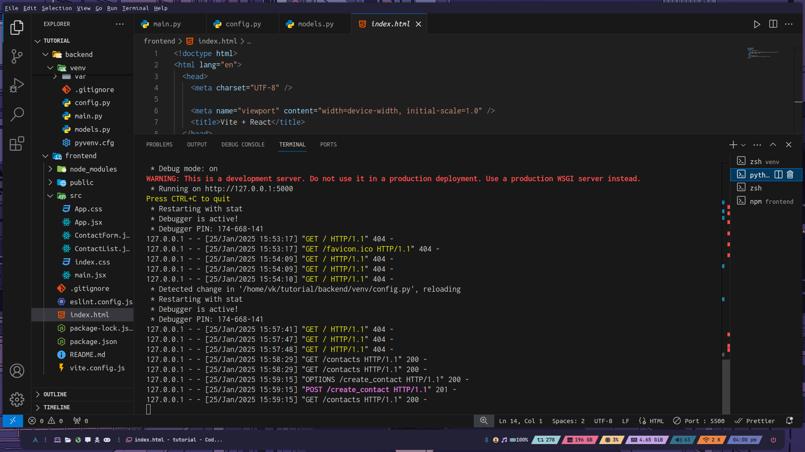
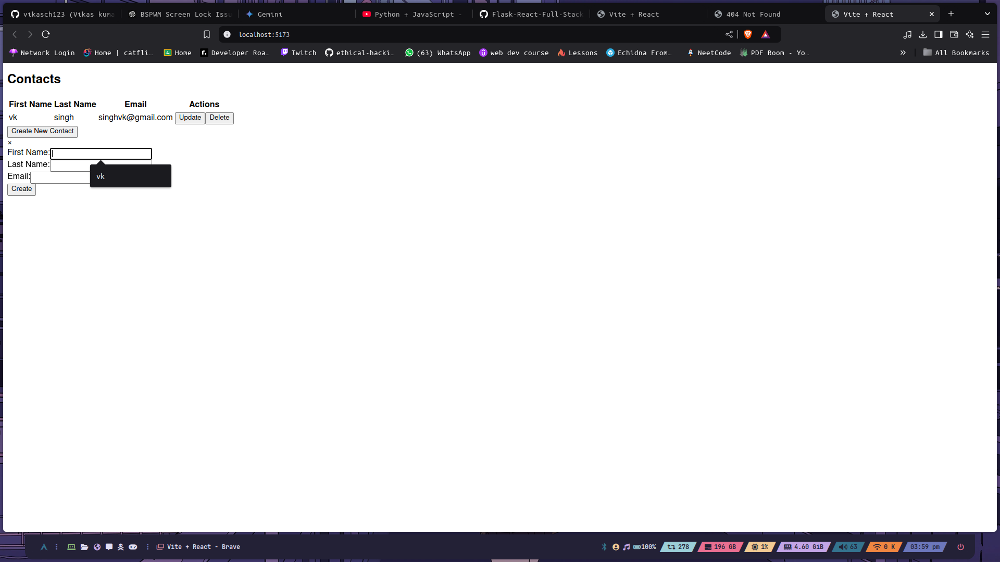
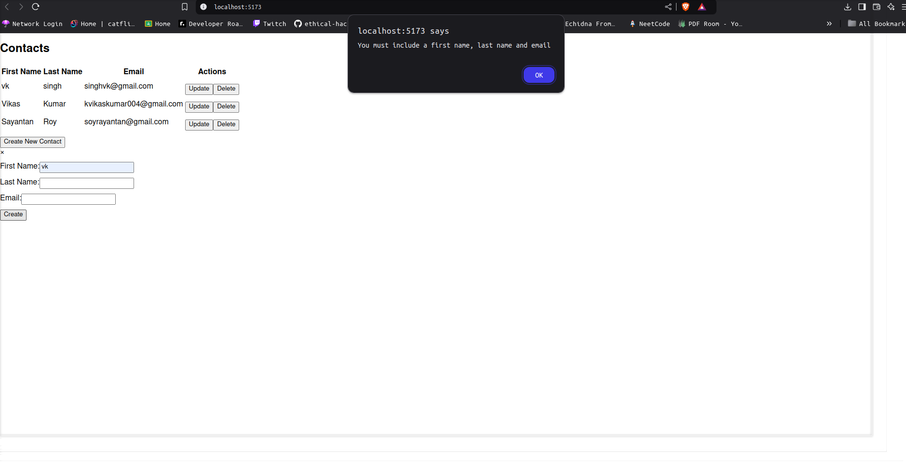
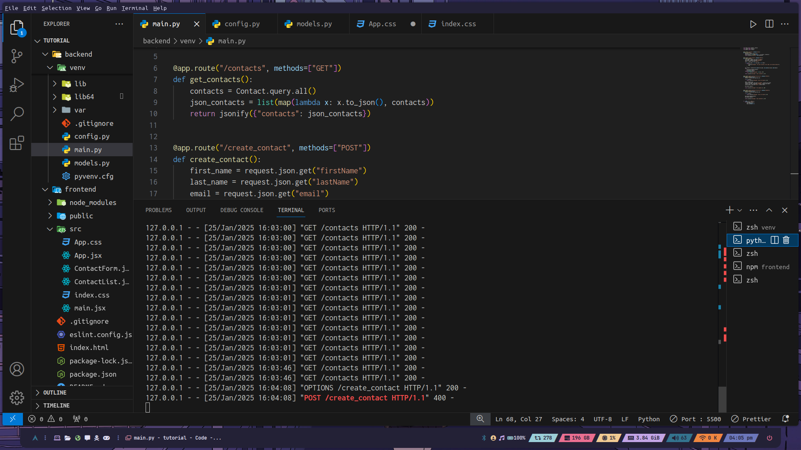
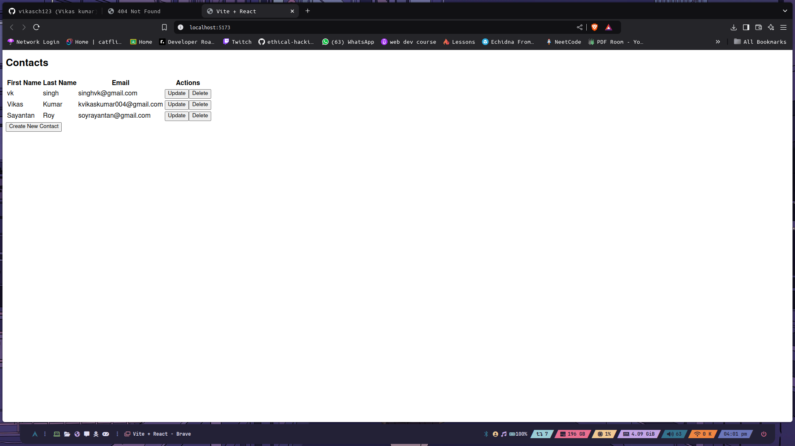

# Contacts Management App 📒

A web application built with React.js for the frontend and Flask for the backend, allowing users to create, update, and delete contact information.


## Features 🌟

- **Frontend**: Built with React.js, utilizing the Tailwind CSS utility-first framework for styling.
- **Backend**: Developed using the Flask web framework in Python, providing a RESTful API for managing contacts.
- **Functionality**: Users can perform CRUD (Create, Read, Update, Delete) operations on contact information, including first name, last name, and email.
- **Responsive Design**: The application is optimized for both desktop and mobile devices.
- **Local Development**: The project can be run locally using Docker for a seamless development experience.

## Getting Started 🚀


### Installation

1. Clone the repository:

   ```bash
   git clone https://github.com/yourusername/contacts-management-app.git
   ```

2. Change to the project directory:

   ```bash
   cd contacts-management-app
   ```

3. Start the application using Docker Compose:

   ```bash
   docker-compose up
   ```

4. Open your web browser and visit `http://localhost:3000` to access the application.

## Terminal Screenshots 💻

Here are some terminal screenshots showing the GET and POST requests:


### Creating Contact

### Errors When entering invalid Values


### Errors in the terminal


### Final View


## Future Improvements 🛠️

- Implement user authentication and authorization.
- Add the ability to upload and manage contact photos.
- Integrate a notification system for updates and deletions.
- Enhance the UI with more modern and interactive design elements.

## What I Learned in This Project 📚

This Contact Management App was a great learning experience where I focused on understanding the **core concepts** rather than spending time on designing a visually appealing website.

### Key Takeaways:
- **Frontend with React:** I learned how to build interactive UI components using React, focusing more on functionality than design.
- **Backend with Python and Flask:** I gained hands-on experience in creating and managing APIs with Flask. I built endpoints, handled requests and responses, and managed routes for performing CRUD operations.
- **Creating and Managing API Calls:** I learned how to make API calls from the frontend and handle them on the backend to create, update, and delete contact information, including fields like name (first and last), email, and contact number.
- **Localhost Development:** I deployed the app on **localhost** and tested all functionality in a local environment before integrating it.

💡 **Note:** Since my primary focus was on understanding the core concepts and backend functionality, the frontend might not be as polished or visually appealing. I'm still learning frontend development and will improve my design skills in future projects.


## Contributing 👥

Contributions are welcome! If you find any issues or have suggestions for improvements, please feel free to open an issue or submit a pull request.

## License 📄

This project is licensed under the [MIT License](LICENSE). ..
